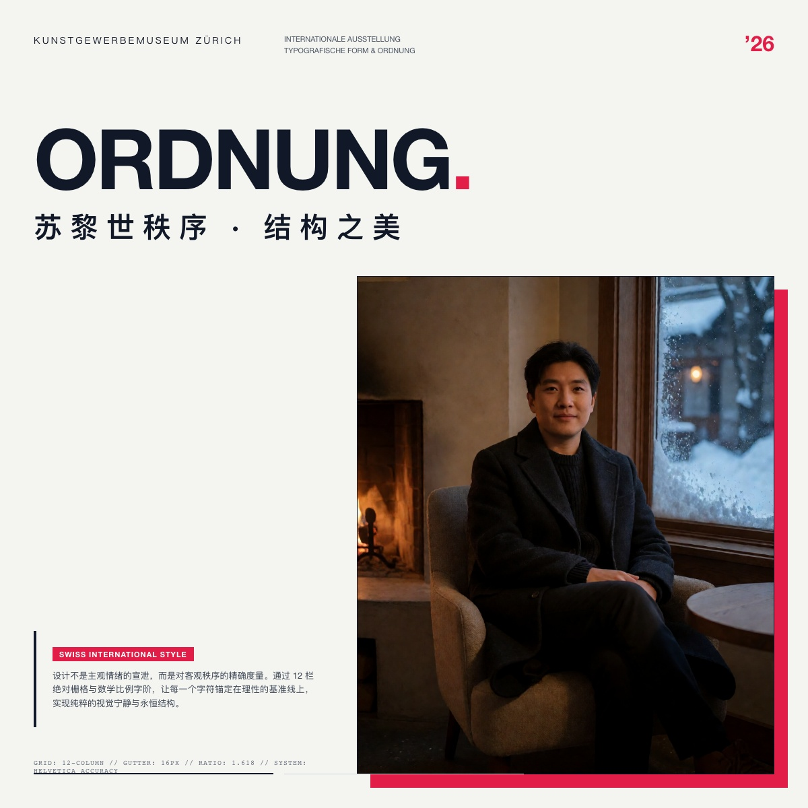
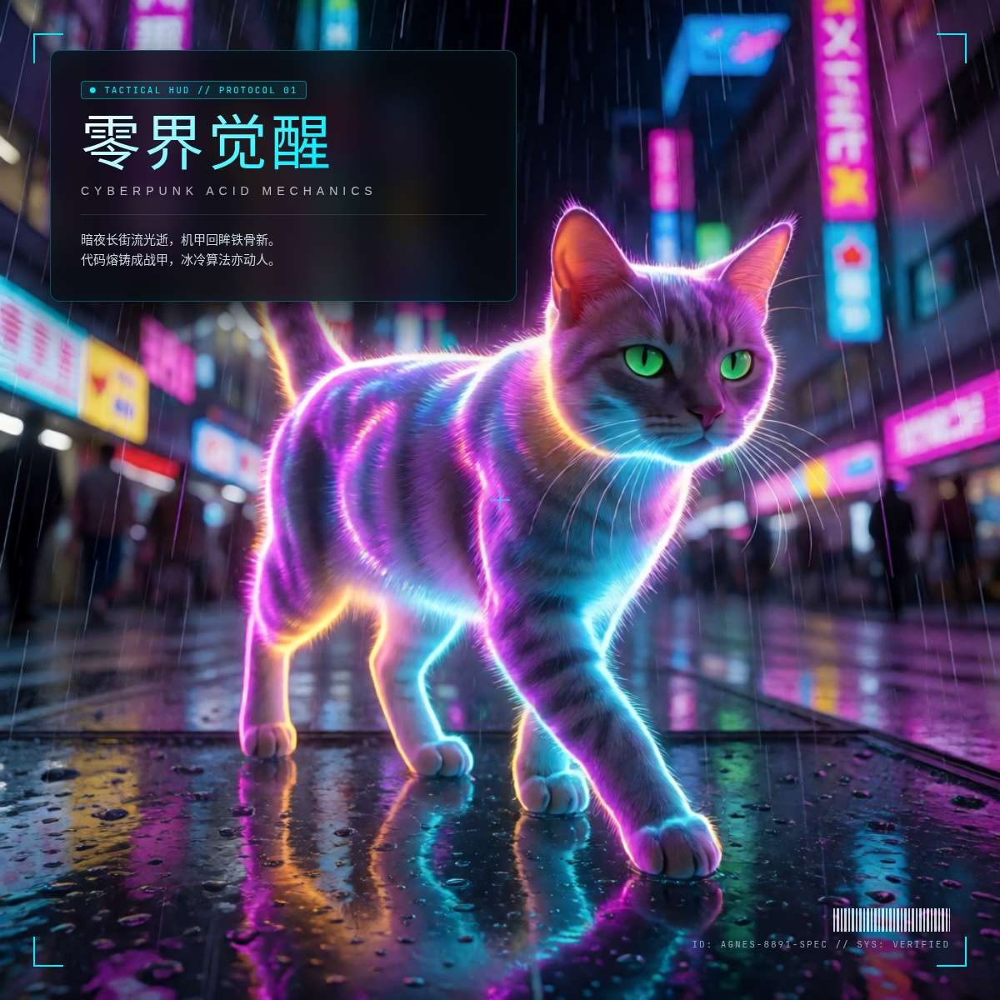
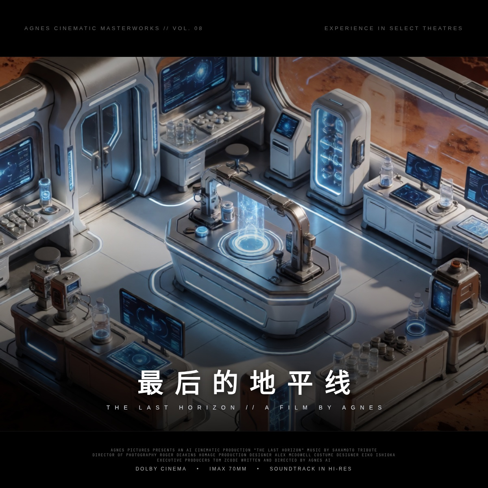

<p align="right">
  <strong>简体中文</strong> · <a href="#english">English</a>
</p>

<div align="center">

# 🎨 Agnes Studio
### 下一代智能多模态视觉工坊 & 工业级商业海报排版引擎
**Next-Generation Multimodal Generative Studio & Professional Poster Engine**

[](https://github.com/tomyiyi/agnes-studio)
[](#-五大顶级商业海报设计架构)
[](#-视觉人脸动态避障体系)
[](LICENSE)

<p align="center">
  
  
  
  
</p>

> **终结扩散模型汉字乱码与传统脚本粗糙贴字的行业痛点。**  
> 采用 **“Agnes AI 负责高审美负空间留白 + HTML5/CSS3 浏览器级亚像素精准排版 + Google Chrome 无头光栅化”** 的工业混合管线，1 秒内交付媲美国际 4A 广告公司的商业级视觉大片。

</div>

---

## 📦 项目总览（Project Summary）

> **完整文档**：[`docs/PROJECT.md`](docs/PROJECT.md) · 更新 2026-09-26

| 资产 | 规模 |
|------|------|
| 图像产出 | **1500+**（`outputs/`） |
| 字在人后迭代 | 946 张 / v1–v159 |
| 版式系统 | L1 十二构图 + L2 中文精修 6 |
| 画廊 | 1000+ 条（工作台「资产画廊」） |
| 脚本 / 规则 | 31 Python / 18 JSON |
| 生图入口 | `scripts/agnes_gateway.py` → New API |
| 中文排版 | 真字体叠字（思源宋 Black 等） |

**硬关系**：`BACKGROUND → TYPE → PERSON`（字在人后）。  
**版式路径**：`outputs/layout_variants/L1|L2/` · 编号板报号验收 · 只增不删。

---

## ⚡ 为什么选择 Agnes Studio？

传统 AI 海报制作通常面临两个死穴：
1. **纯模型生成汉字必然乱码**：Diffusion / Flux 模型受限于 T5 文本编码器的汉字先验缺失，方块字笔画频繁断裂扭曲，极易产生“鬼画符”；
2. **传统脚本贴字充满廉价感**：常规 Python PIL/Pillow 只能机械地给图片叠字，缺乏文字渐变（Gradient）、图层混合（Mix-Blend-Mode）、高斯模糊（Backdrop-Filter）与呼吸网格系统，产生严重的“机器脚本感”。

**Agnes Studio 从底层重构了这一范式：**
- **矢量解耦**：模型专注于 100% 的光影、质感与负空间留白；CSS3 专注于 100% 的矢量字形、字距与微型微排版；
- **真实浏览器光栅化**：调用系统原生 Google Chrome 无头渲染管线，实现 1200×1200 亚像素级抗锯齿与电影级视效；
- **智能人脸避障**：内嵌 macOS 原生 Vision 视觉检测，毫秒级定位人物主体坐标，动态触发对角拆字与走廊留白；
- **统一模型网关设置中心**：本地部署自动感应 New API 密钥池，其他用户或在不同电脑上克隆，仅需在界面填入 Agnes API 密钥即可直接运行；
- **零依赖跨端同步**：轻量级架构，配套 `./sync.sh` 与 `./start.sh`，在任何个人电脑、Mac、Linux 或云端工作站之间无缝秒级同步迭代。

---

## ⚙️ Agnes 模型网关与后台设置中心 (Model Gateway)

为了让任何人在不同电脑上克隆本项目后都能一键跑通，工作台内建了 **Agnes 模型网关与后台配置中心**：

<p align="center">
  
  
  
</p>

### 1. 本地零配置自动感应 (Zero-Config)
- 服务端启动时，会自动探测主机上的 `~/.new-api/local_key.json`，优先接入本地运行的 6 Key 负载均衡聚合网关（`http://127.0.0.1:3000/v1`）；
- 具备自动探活、毫秒级延迟检测与模型列表回显能力。

### 2. 外部用户与异地电脑使用 (Any Computer Ready)
- 点击顶部导航右侧的 **`⚙️ 设置`**（或状态徽标），即可唤出网关配置中心；
- 支持预设一键切换：
  - **本地 New API 负载均衡**：`http://127.0.0.1:3000/v1`
  - **Agnes AI 官方端点直连**：`https://apihub.agnes-ai.com/v1`
  - **自定义中继 / OneAPI 聚合网关**
- 填入个人获取的 Agnes API Key，点击 **「⚡ 测试网关连通性」** 即可实时显示当前延迟（毫秒）与可用模型列表；
- 点击 **「💾 保存配置」** 后，所有设置持久化保存在当前浏览器的 `LocalStorage` 中，无需修改任何代码文件，下次访问自动加载。

---

## 🎨 实时自定义文案海报工坊 (Live Poster Studio)

在海报工坊左侧控制台，内置了 **实时自定义海报生成器**：
1. 输入自定义 **主标题**（如《苏黎世秩序》）、**英文副标**、**正文金句或古诗七绝**、**署名**；
2. 选择 **排版流派风格**（瑞士国际网格、赛博机能 HUD、新中式当代金石、院线宽银幕等）；
3. 选用 **高审美留白底图**；
4. 点击 **「🚀 一键光栅化渲染商业海报」**，后台无头浏览器在 1~2 秒内完成动态排版与 1200×1200 超清光栅化合成，直接刷新展示视口并支持 4K 原图下载！

---

## 🏛️ 五大顶级商业海报设计架构 (Design Archetypes)

深度吸收 GitHub 顶尖开源项目（`ResponsiveMullerBrockmann`、`article-poster-generator`、`canvas-design` 与 `fantasy-movie-poster-skill`）的设计精髓，内置 5 大流派共 10 套开箱即用的高审美独立示例：

| 架构流派 | 核心设计语法 | 视觉与排印元素 | 落地成图文件 |
| :--- | :--- | :--- | :--- |
| **📐 01 · 瑞士国际网格流派**<br>*(Swiss Grid Style)* | 致敬约瑟夫·米勒-布罗克曼，极端非对称平衡与理性数学栅格 | 12 栏绝对红黑栅格、124px 巨型无衬线字标穿透版芯、瑞士红 (`#E11D48`) 强调块、45° 同心圆对角空间动势 | [`poster_pro_swiss_01.png`](public/assets/poster_pro_swiss_01.png)<br>[`poster_pro_swiss_02.png`](public/assets/poster_pro_swiss_02.png) |
| **📰 02 · 长文杂志信息图流派**<br>*(Article Poster Generator)* | 吸收 `article-poster-generator`，严肃深度刊物与知识信息图 | CNC 金属冷调底衬 (`#141414`) + 猩红高光 (`#CC4444`)、特刊刊头、半透毛玻璃核心观点卡片、矢量条形码与阅读时长元数据 | [`poster_pro_article_01.png`](public/assets/poster_pro_article_01.png)<br>[`poster_pro_article_02.png`](public/assets/poster_pro_article_02.png) |
| **⚡ 03 · 先锋酸性与赛博机能**<br>*(Cyber Acid Tech HUD)* | 先锋工业机能 HUD 战术界面与 Y2K 新野兽主义先锋冲撞 | 四角 L 型战术定位框、✛ 字中央瞄准准心、得意黑 8° 窄斜体电光青蓝渐变、Y2K 荧光绿与品红暴力撞色、命令行终端日志卡片 | [`poster_pro_cyber_01.png`](public/assets/poster_pro_cyber_01.png)<br>[`poster_pro_cyber_02.png`](public/assets/poster_pro_cyber_02.png) |
| **🪨 04 · 新中式当代金石意境**<br>*(Neo-Chinese Poetics)* | 汲取南宋马远夏圭“边角之景”，东方古韵与现代高画质交融 | macOS Vision 面部识别避障、中轴 40% 走廊彻底留白、刀刻思源大宋体对角错位拆字、霞鹜小楷七绝诗词、古法朱砂红方印 | [`poster_pro_chinese_01.png`](public/assets/poster_pro_chinese_01.png)<br>[`poster_pro_chinese_02.png`](public/assets/poster_pro_chinese_02.png) |
| **🎬 05 · 院线 2.35:1 宽银幕大片**<br>*(Cinematic Billing Block)* | 好莱坞电影工业叙事压迫感与国际电影节官方评奖质感 | 上下 14% 极深纯黑遮幅（Letterbox）、刀刻大宋体超宽字距 (28px)、密集演职员微排版 (Billing Block)、Dolby/IMAX 矢量标、电影节双金冠桂冠 | [`poster_pro_cinema_01.png`](public/assets/poster_pro_cinema_01.png)<br>[`poster_pro_cinema_02.png`](public/assets/poster_pro_cinema_02.png) |

---

## 🚀 快速启动（跨电脑即拉即跑）

项目已做到开箱即用，无需复杂的环境配置与数据库，适合在个人电脑、开发机与工作站之间无缝同步：

### 1. 克隆代码
```bash
git clone https://github.com/tomyiyi/agnes-studio.git
cd agnes-studio
```

### 2. 安装必要渲染环境（仅需 Python + Playwright）
```bash
pip3 install playwright
# 若本机未安装 Google Chrome，可自动安装无头驱动：
python3 -m playwright install chromium
```

### 3. 一键启动前台交互工坊
运行自带便携脚本：
```bash
./start.sh
```
或直接通过 Python 启动：
```bash
python3 -m http.server 8088 --directory public
```
浏览器访问：**`http://localhost:8088/#poster-studio`**

---

## 🛠️ 核心功能与操作指令

### 1. 批量渲染 10 款商业大师级海报
```bash
python3 scripts/pro_poster_renderer.py
```
*仅需约 25 秒，即可调用 Chrome 引擎并发光栅化渲染出全套 1200×1200 超清商业大作，输出至 `public/assets/`。*

### 2. 单独渲染指定流派
```bash
# 单独渲染瑞士网格海报
python3 scripts/pro_poster_renderer.py --key swiss_01

# 单独渲染赛博机能海报
python3 scripts/pro_poster_renderer.py --key cyber_01

# 单独渲染新中式避障海报
python3 scripts/pro_poster_renderer.py --key chinese_01
```

### 3. 前台专业检视能力
- **交互式瑞士 12 栏参考线（开/关）**：前台一键调出淡青色 12 栏辅助参考线，实时核验各信息层级与字符基线；
- **暗房黑 🖤 / 展厅白 🤍 底衬切换**：适应明暗不同调性的海报质感检视；
- **防 CLS 视口装裱**：容器自适应弹性居中，切换画幅与预设时视口高度零抖动；
- **4K 无损放大全屏检视**：支持点击海报查看原画细节与矢量条码微排版，并提供一键原图下载。

---

## 📂 项目结构全景

```text
agnes-studio/
├── public/                     # 前台静态资产与工作台
│   ├── index.html              # 交互式海报工坊与全景画廊
│   ├── assets/                 # 渲染产出的 10 款商业海报与高清底图库
│   └── fonts/                  # 开源精修字体包 (得意黑、霞鹜文楷等)
├── scripts/                    # 工业级排版与渲染核心管线
│   ├── studio_server.py        # 轻量自包含 API 服务端 (配置探测/健康探活/海报渲染)
│   ├── pro_poster_renderer.py  # 5 大架构 × 10 款商业大作无头光栅化引擎
│   ├── typography_rules.py     # 瑞士 12 栏网格推导与盘古之白中西排版规范
│   ├── vision_subject_detector.py # macOS Vision 原生面部避障坐标检测
│   └── film_cover_engine.py    # 经典电影感与书生系列排版实验器
├── data/                       # 提示词词典与视觉元数据
├── start.sh                    # 跨电脑一键启动脚本 (自动拉取最新更新并启动服务)
├── sync.sh                     # 跨电脑一键双向同步脚本 (自动 rebase 远端并提交推送)
└── package.json                # 项目元数据与脚本配置
```

---

<div id="english"></div>

## 🌐 English Summary

**Agnes Studio** is a professional AI visual studio and production-grade poster typography engine designed to eliminate garbled Chinese characters from AI generation models and replace naive PIL text overlays with real **HTML5/CSS3 + Headless Chrome subpixel rasterization**.

### Highlights
- **Hybrid AI Architecture**: High-aesthetic negative space generated by Agnes Diffusion models + 100% precise CSS3 vector typography.
- **Integrated Model Gateway**: Built-in backend configuration center supporting local New API auto-detection (`~/.new-api/local_key.json`), official Agnes AI cloud endpoint, or custom OneAPI reverse proxies.
- **Live Custom Poster Studio**: Interactive typography workshop to compose headlines, body copy, and styles in real-time, rendering 1200×1200 production posters in seconds.
- **5 Design Archetypes**: Swiss Grid (Müller-Brockmann homage), Modern Article Info-posters, Cyber Acid Tech HUD, Neo-Chinese Poetics (Face-avoidance layout), and Cinematic 2.35:1 Billing Block.
- **Cross-Machine Ready**: Lightweight, single-command startup and two-way sync with `./start.sh` and `./sync.sh`.

---

## 📜 许可与致谢

- 基于 MIT 协议开源。
- 特别致谢开源项目与字体作者：
  - [ResponsiveMullerBrockmann](https://github.com/laurasandoval/ResponsiveMullerBrockmann)
  - [article-poster-generator](https://github.com/tengj/article-poster-generator)
  - [SmileySans 得意黑](https://github.com/atelier-anchor/smiley-sans)
  - [LXGW WenKai 霞鹜文楷](https://github.com/lxgw/LxgwWenKai)
  - [oil-oil](https://github.com/oil-oil) 提供的精美 README 视觉组织范式

---

<p align="center">
  Crafted with precision by <strong>Tom</strong> (@tomyiyi)
</p>
