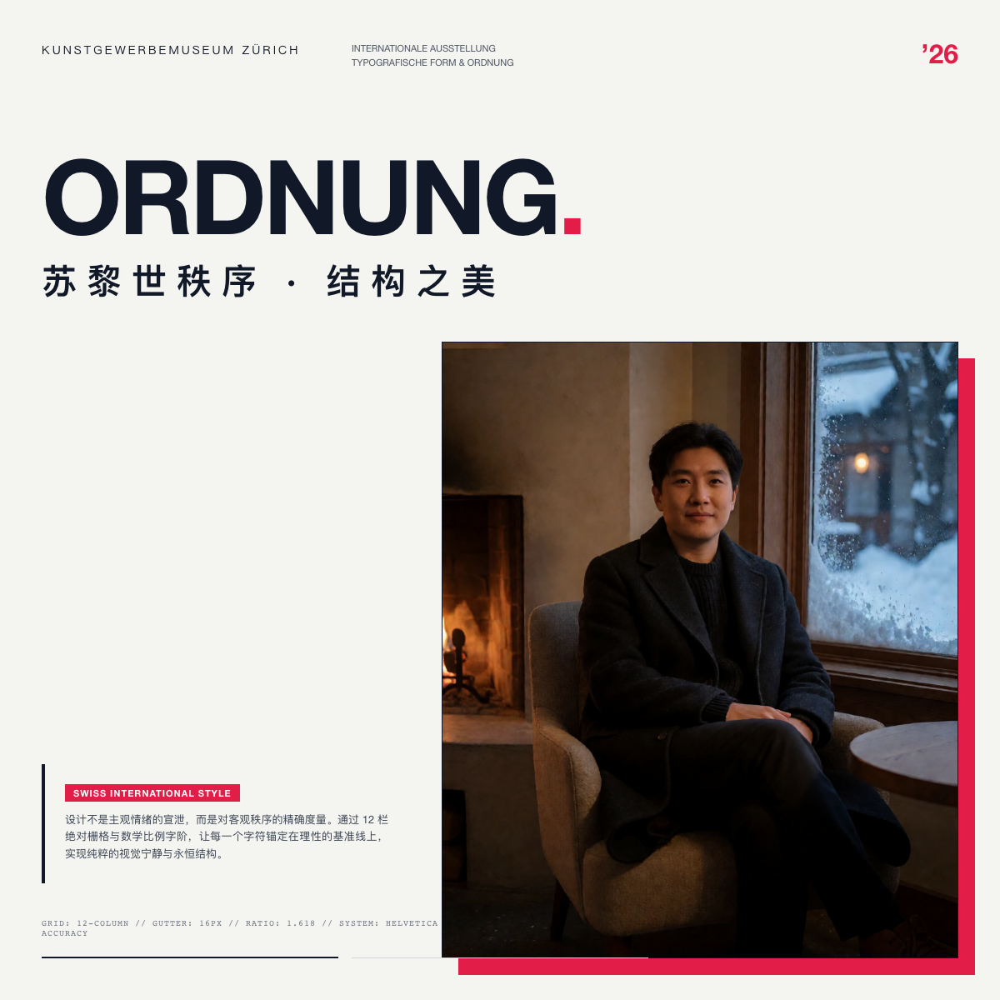
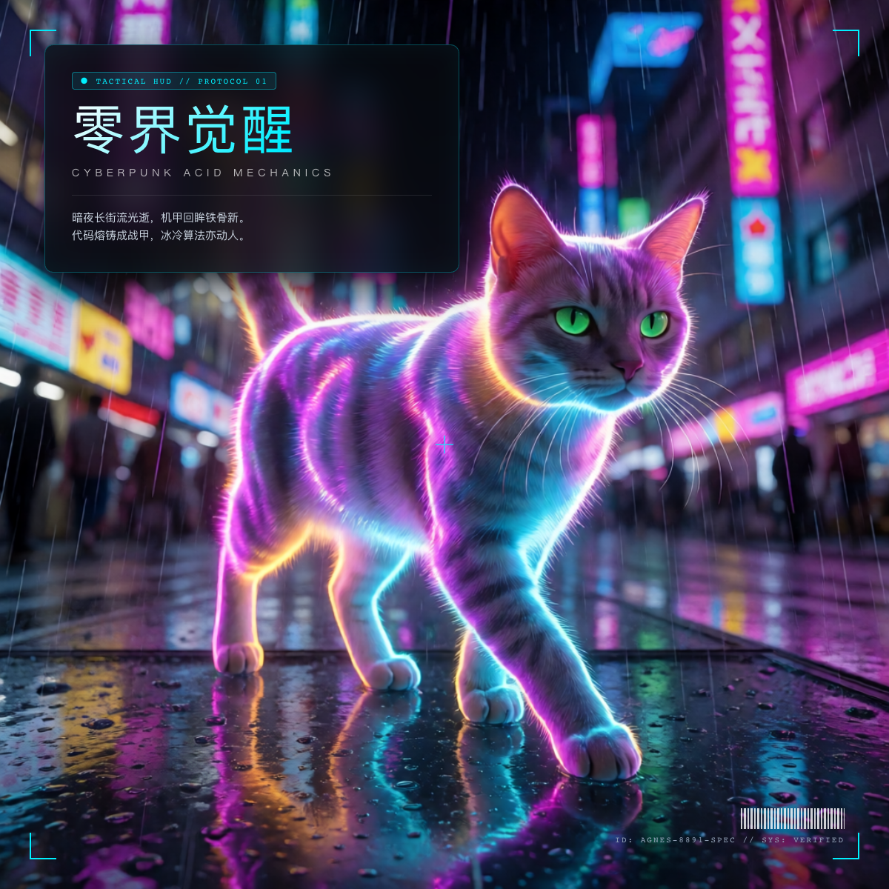
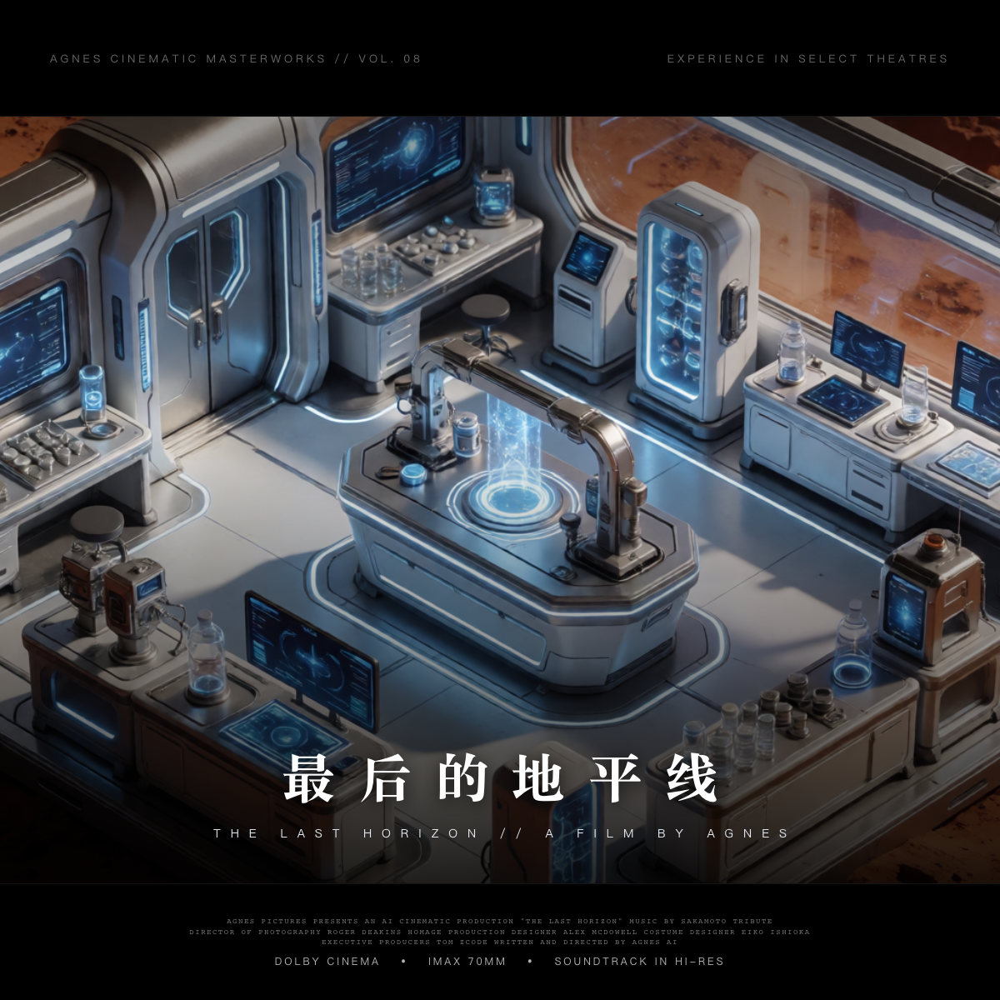

<p align="right">
  <strong>简体中文</strong> · <a href="#english">English</a>
</p>

<div align="center">

# 🎨 Agnes Studio

**AI 海报排版引擎：扩散模型只负责画留白底图，文字全部走 HTML/CSS 矢量排版、再经无头 Chrome 光栅化合成——中文海报不再乱码。**

[](https://github.com/tomyiyi/agnes-studio/actions/workflows/ci.yml)
[](LICENSE)
[](https://www.python.org/)

<p align="center">
  
  
  
  
</p>

</div>

---

## 为什么是这条管线

纯模型生图写中文容易出现乱码断笔；直接用 PIL 往图上叠字，又做不出 CSS 的渐变、混合模式、毛玻璃与网格系统。Agnes Studio 把两者解耦：

- **底图**：AI 生成的高审美留白背景（`scripts/agnes_gateway.py`），或直接复用 `public/assets/` 里的现成底图；
- **文字层**：HTML/CSS 矢量排版，中文按真实字体（得意黑、霞鹜文楷，见 `public/fonts/`）渲染；
- **合成**：无头 Chrome 1200×1200 光栅化截图，亚像素抗锯齿。

## 架构

```
                         ┌─────────────────────────┐
  留白底图 ─────────────▶ │ pro_poster_renderer.py  │ ──▶ 无头 Chrome ──▶ 1200×1200 PNG
  (AI 生成 / 现成 assets) │  HTML + CSS 矢量排版     │     (Playwright)      public/assets/
                         └─────────────────────────┘

┌──────────────────────────────────────────────────────────────┐
│ studio_server.py → http://localhost:8088/（静态服务 public/） │
│   GET  /api/config          网关探测：~/.new-api/local_key.json │
│   POST /api/generate-image  留白底图生成（需 API Key）          │
│   POST /api/test-connection 网关连通性测试（需 API Key）        │
└──────────────────────────────────────────────────────────────┘
```

完整系统蓝图见 [docs/ARCHITECTURE.md](docs/ARCHITECTURE.md)。

## Features（已落地，如实）

- **图字分层**：AI 只画留白底图，文字走 HTML/CSS 矢量排版——中文海报不乱码
- **10 款海报模板**：瑞士网格 / 赛博机能 / 新中式 / 院线大片等，开箱即用
- **真实中文字体**：得意黑、霞鹜文楷等，`public/fonts/` 自带
- **无头 Chrome 合成**：1200×1200 PNG，亚像素抗锯齿
- **工作台**：`studio_server.py` 本地 Web UI，浏览模板、调参、生成
- **设计资产可复用**：`data/` 下的配色/字体/版式规则可被外部管线读取（ppt-studio 已接入）

## 和同类方案的区别（诚实版）

| | agnes-studio | 纯 AI 生图（Midjourney 等） | Canva / Figma 手排 |
|---|---|---|---|
| 中文文字 | 矢量排版，零乱码 | 易乱码断笔 | 手动输入，无乱码 |
| 底图审美 | AI 生成留白底图 | 整图生成 | 自己找图/画图 |
| 批量/自动化 | 脚本+API，可进管线 | 单张生成 | 手动为主 |
| 可编辑性 | HTML/CSS 源码级 | 出图即定稿 | 完全可编辑 |
| 门槛 | 需 Python 环境 | 会写提示词即可 | 会设计软件即可 |

> 不夸大：底图质量看模型；10 款模板是起点不是终点；工作台是本地工具不是 SaaS。

## 快速启动（已在干净 venv 实测）

```bash
git clone https://github.com/tomyiyi/agnes-studio.git
cd agnes-studio

python3 -m venv .venv
source .venv/bin/activate
pip install -r requirements.txt          # playwright / pillow / numpy，实测约 10 秒

# 本机没有 Chrome/Chromium 时才需要：安装 Playwright 自带浏览器
python -m playwright install chromium

# 渲染一张海报（无需 API Key，实测约 6 秒）
python3 scripts/pro_poster_renderer.py --key swiss_01
# → public/assets/poster_pro_swiss_01.png（1200×1200）

# 启动工作台（默认 8088，浏览器打开 http://localhost:8088/）
python3 scripts/studio_server.py
```

也可用 `./start.sh` 一键启动（`PORT` 环境变量改端口，`./start.sh --update` 才拉取远程更新）。

内置 5 大流派 × 10 款海报（`POSTER_REGISTRY`，`--key` 单渲其一，不加 `--key` 默认全渲）：

| 流派 | keys |
|---|---|
| 瑞士国际主义网格 | `swiss_01` `swiss_02` |
| 长文杂志与现代信息图 | `article_01` `article_02` |
| 先锋酸性与赛博机能 | `cyber_01` `cyber_02` |
| 新中式当代金石意境 | `chinese_01` `chinese_02` |
| 院线 2.35:1 宽银幕大片 | `cinema_01` `cinema_02` |

## 无 Key 可用边界

| 功能 | 无 API Key 是否可用 |
|---|---|
| `pro_poster_renderer.py` 海报渲染（10 款） | ✅ 可用（脚本内无任何 Key 引用） |
| `studio_server.py` 工作台浏览、`/api/config` 探测 | ✅ 可用（无 Key 时显示未探测到网关） |
| `/api/generate-image` 留白底图生成 | ❌ 需要 Agnes API Key |
| `/api/test-connection` 网关连通性测试 | ❌ 需要 Agnes API Key |

配置 Key 的两种方式：复制 `local_key.json.example` 为 `~/.new-api/local_key.json` 填入（服务端自动感应），或在工作台设置页填写。默认网关 `http://127.0.0.1:3000/v1`，也支持 Agnes AI 官方端点与自定义 OneAPI 中继。

## Troubleshooting

**`ModuleNotFoundError: No module named 'PIL'`**
`poster_composer.py` 等 7 个脚本顶部 `from PIL import …` 需要 Pillow。解法：`pip install -r requirements.txt`（`pillow>=12.3` 已在依赖清单中）。

**Chrome 找不到 / Playwright 报错浏览器可执行文件不存在**
渲染器按 `scripts/env_config.py::resolve_chrome_path()` 依次查找：`CHROME_PATH` 环境变量 → 系统 Chrome/Chromium → 都没有则回退 Playwright 自带 Chromium。解法三选一：安装系统 Chrome；或运行 `python -m playwright install chromium`；或 `export CHROME_PATH=/path/to/chrome`。

**`OSError: [Errno 48] Address already in use`（端口 8088 被占）**
换端口启动：`PORT=8089 ./start.sh` 或 `python3 scripts/studio_server.py 8089`。注意 `./start.sh` 遇到端口占用会直接报错退出并列出占用进程，绝不会自动 kill。

## 更多文档

- [docs/ARCHITECTURE.md](docs/ARCHITECTURE.md) —— 全景系统架构与技术蓝图
- [docs/PROJECT.md](docs/PROJECT.md) —— 项目说明
- [docs/WORKFLOWS.md](docs/WORKFLOWS.md) —— 工作流

---

## English

**Agnes Studio** is a poster typography engine: diffusion models paint only the negative-space background, while all text is laid out as real HTML/CSS vector typography and composited via headless Chrome rasterization — so CJK text never comes out garbled.

- **Renderer**: `python3 scripts/pro_poster_renderer.py --key swiss_01` → 1200×1200 PNG in `public/assets/`, no API key needed. 10 posters across 5 design archetypes (`POSTER_REGISTRY`); omit `--key` to render all.
- **Studio server**: `python3 scripts/studio_server.py` → `http://localhost:8088/`. Serves the `public/` frontend plus `/api/*` endpoints.
- **Model gateway**: auto-detects `~/.new-api/local_key.json` (see `local_key.json.example`); defaults to `http://127.0.0.1:3000/v1`. Image generation and gateway calls require an Agnes API key; rendering does not.
- **Chrome resolution**: system Chrome/Chromium if present, otherwise Playwright's bundled Chromium (`python -m playwright install chromium`), overridable via `CHROME_PATH`.
- **Docs**: [docs/ARCHITECTURE.md](docs/ARCHITECTURE.md) · MIT licensed.

---

Crafted by **Tom** ([@tomyiyi](https://github.com/tomyiyi)) · 如果这个项目对你有用，欢迎点个 ⭐ Star！
